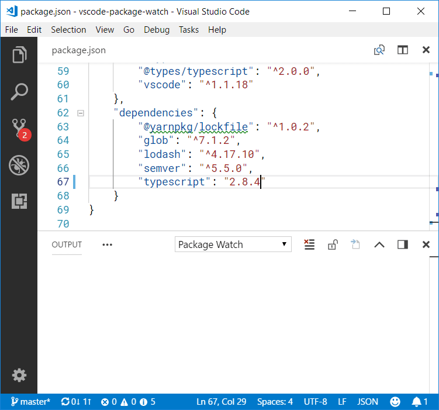

# VSCode Package Watch

**Package Watch** is a Visual Studio Code extension that checks and installs the local node dependencies. It monitors your `package.json`, `package-lock.json` or `yarn.lock`, and installs the missing/outdated node dependencies using `yarn` or `npm` automatically.

## Basic usage

As soon as **Package Watch** is installed, the extension offers the following features:

- Running `packageWatch.checkDependencies` command finds all of your `package.json` inside the current workspace, and tells if all node dependency is in-sync.
- Running `packageWatch.installDependencies` command executes either `yarn install --check-files` or `npm install`, and finally runs `packageWatch.checkDependencies` command.
- When a workspace containing `package.json` is opened, `packageWatch.checkDependencies` command is triggered automatically.
- When `package.json`, `package-lock.json` or `yarn.lock` gets added/modified, `packageWatch.checkDependencies` command is triggered automatically.
- The extension supports [Yarn Workspace](https://yarnpkg.com/en/docs/workspaces) out of the box. It runs `yarn install` only once for those linked directories.
- The extension checks if a dependency is in-sync by reading the version numbers from `package.json`, `package-lock.json`/`yarn.lock`, and `node_modules/*/package.json`.
- The extension prefers `yarn install`, if both `package-lock.json` and `yarn.lock` are found.
- The extension prefers `yarn install`, if neither `package-lock.json` nor `yarn.lock` are found and `which yarn` results in a success.
- After running `packageWatch.installDependencies` command, if the node dependencies are still not in-sync, the second try will execute either `yarn install --check-files --force` or `npm install --force`.
